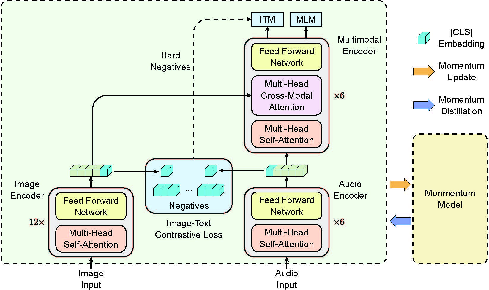

# Multimodal Emotion Recognition in PyTorch (MER23 & MuSe-Mimic Challenges)


Here is the PyTorch implementation of methods proposed in ''*Building Robust Multimodal Sentiment Analysis using a Simple yet Effective Multimodal Transformer*'' and ''*Learning Aligned Audiovisual Representations for Multimodal Sentiment Analysis*''.

**Paper Title: "Building Robust Multimodal Sentiment Analysis using a Simple yet Effective Multimodal Transformer"**

**Accepted by: ACM MM 2023 Grand Challenge**

**Paper Title: "Learning Aligned Audiovisual Representations for Multimodal Sentiment Analysis"**

**Accepted by: ACM MM 2023 MRAC Workshop**


## Method Introduction
Pipeline of our VAT method, consisting of three submodules (an image encoder, a text encoder, and a multimodal encoder):
1. To facilitate fusion, we introduce a video-audio contrastive loss that aligns the unimodal representations of a video-audio pair.
2. By leveraging in-batch hard negatives obtained through contrastive similarity, a video-audio matching loss is employed to capture multimodal interactions between videos and audios.
3. To enhance the model’s robustness to noisy data, we incorporate pseudo-targets generated using the momentum model, which serves as an additional form of supervision during training.
<div  align="center">    

</div>


## Main Dependencies
+ Ubuntu 16.04
+ CUDA Version: 11.1
+ PyTorch 1.8.1
+ torchvision 0.9.1
+ python 3.7.6


## Usage
### Data Preparation
Download Original Dataset：
[CHEAVD2.0](https://drive.google.com/file/d/1LOW2e6ZuyUjurVF0SNPisqSh4VzEl5lN/edit),
[MuSe-Mimic](https://www.muse-challenge.org/muse-2023),

### Pre-processing

For CHEAVD2.0 and MuSe-Mimic dataset, we provide code to pre-process videos into RGB frames and audio wav files in the directory ```data/```.


### Training and Evaluation

COMING SOON.

<!-- ## Citation
If you find this work useful, please consider citing it.

<pre><code>
@inproceedings{ding2023mmer,
  title={Building Robust Multimodal Sentiment Analysis using a Simple yet Effective Multimodal Transformer},
  author={Ding, Chaoyue and Zong, Daoming and Li, Baoxiang and Zheng, Ken and Zhou, Dinghao and Li, Jiakui and Zhou, Qunyan},
  booktitle={Proceedings of the 31th ACM International Conference on Multimedia Grand Challenges Track},
  year={2023}
}

@inproceedings{ding2023mmer,
  title={Learning Aligned Audiovisual Representations for Multimodal Sentiment Analysis},
  author={Ding, Chaoyue and Zong, Daoming and Li, Baoxiang and Zhou, Dinghao and Li, Jiakui and Zheng, Ken and Zhou, Qunyan},
  booktitle={Proceedings of the 1st International Workshop on Multimodal and Responsible Affective Computing},
  year={2023}
}

</code></pre> -->

## Acknowledgement

This research was supported by SenseTime Research.

## License

This project is released under the [GNU General Public License v3.0](https://github.com/Mukosame/Zooming-Slow-Mo-CVPR-2020/blob/master/LICENSE).

<!-- 
## Contact us

If you have any detailed questions or suggestions, you can email us:
**dingchaoyue@sensetime.com** -->
